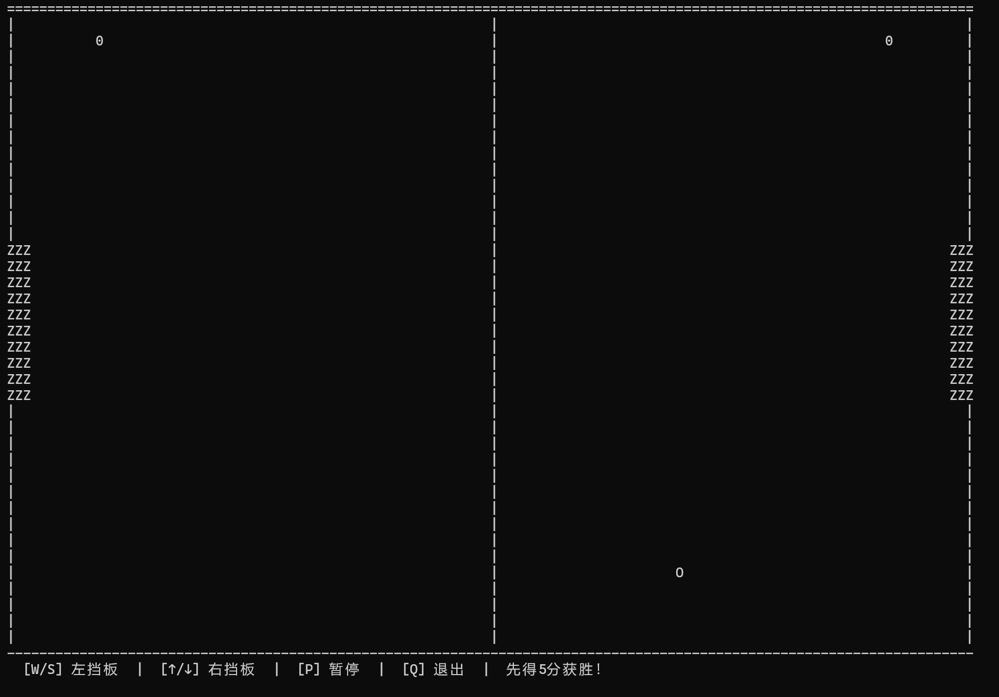
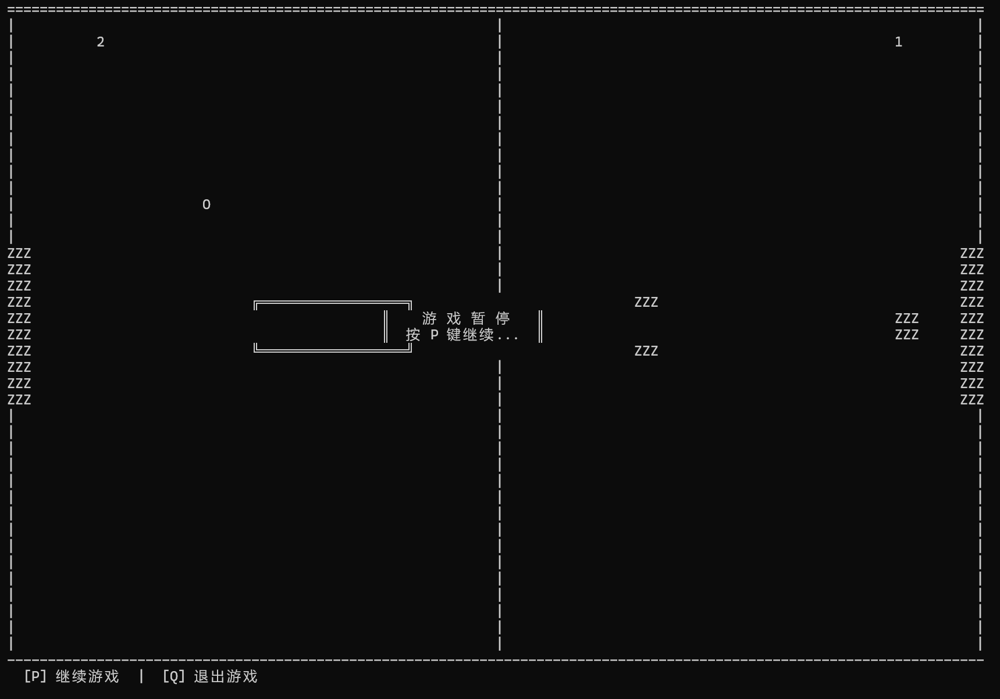
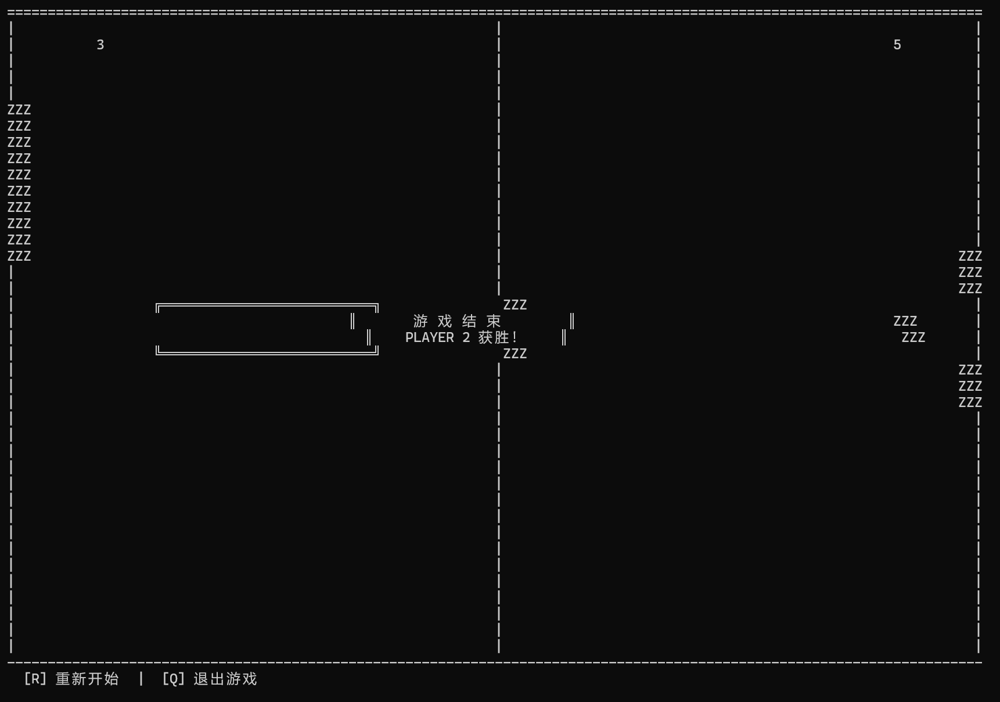
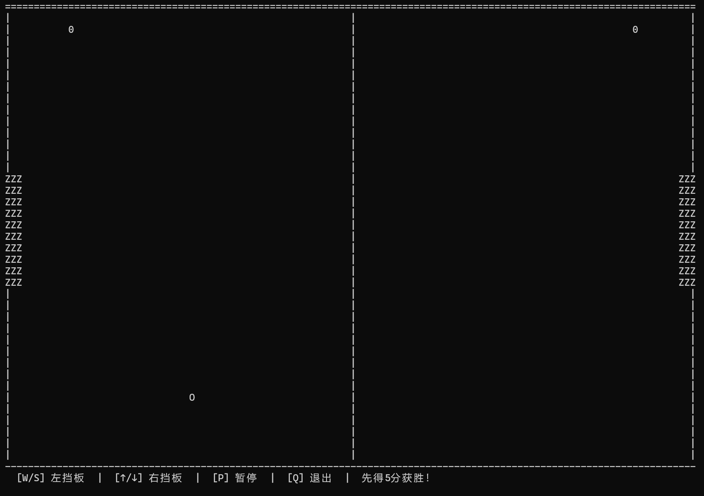

# Pong 游戏改进

> C++ 函数应用实验 — 用函数重构 Pong 并增加多项改进

## 改进内容

在原版 Pong 游戏基础上，拆分为 **7 个函数**，并实现三项改进：

| 改进 | 描述 |
|------|------|
| **D — 暂停功能** | 按 P 键暂停/继续，画面冻结 + 居中覆盖层 |
| **A — 5分获胜** | 先得 5 分者获胜，显示 PLAYER X 获胜，按 R 重新开始 |
| **C — 底部提示栏** | 2 行动态提示，随正常/暂停/结束状态切换 |

## 游戏截图






## 编译与运行

```bash
g++ -std=c++14 -fexec-charset=UTF-8 -o pong_improved.exe pong_improved.cpp
./pong_improved.exe
```

## 操作说明

| 按键 | 功能 |
|------|------|
| W / S | 左挡板上下移动 |
| ↑ / ↓ | 右挡板上下移动 |
| P | 暂停 / 继续 |
| R | 游戏结束后重新开始 |
| Q | 退出游戏 |

## 文件结构

```
├── pong_improved.cpp       # 改进版游戏（7个函数，main()仅50行）
├── 4_pong.cpp              # 原版教材游戏
├── generate_pong_report.py # PDF 报告生成脚本
├── 1030425213_张轩基_Pong改进实验报告.pdf  # 实验报告
├── Pictures/               # 运行截图
└── README.md
```

## 函数架构

```
main()                    
├── handle_input()        ← 按键处理 + 状态判断
├── update_game()         ← 物理 + 碰撞 + 计分 + 获胜检测
├── render_frame()        ← 帧缓冲绘制
│   ├── draw_centered_overlay()  ← 暂停/获胜覆盖层
│   └── draw_info_bar()          ← 底部提示栏
└── reset_game()          ← 一键重置所有状态
```
